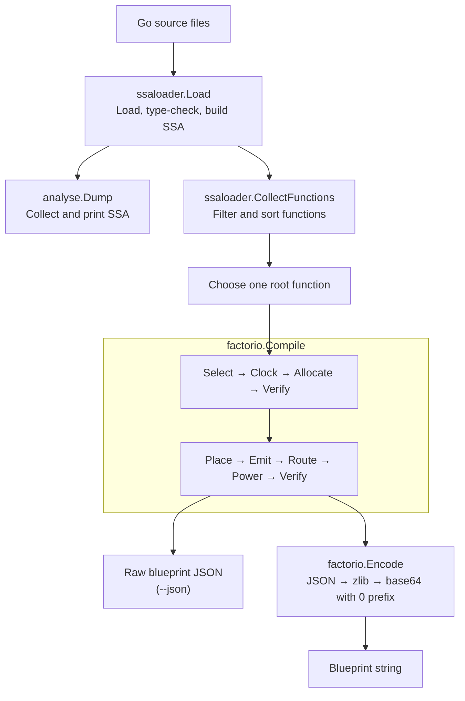

# Architecture

`gofactos` turns Go source into Factorio circuits. It uses
`golang.org/x/tools/go/ssa` as the boundary between the Go front end and the
Factorio backend.

## Glossary

| Term                                                  | Meaning                                                                          |
|-------------------------------------------------------|----------------------------------------------------------------------------------|
| [Backend](backend.md)                                 | Turns the program representation into a Factorio blueprint.                      |
| [Blueprint](blueprint.md)                             | Describes entities, their settings, and their wires.                             |
| [Callee](spec.md#calls)                               | A function reached through the root's calls.                                     |
| Disassembly                                           | A readable listing of a function's SSA instructions.                             |
| [E2E](testing.md#headless-factorio-e2e)               | An end-to-end test that exercises the complete command and generated circuit.    |
| [Entity](blueprint.md#entity)                         | One placed Factorio object.                                                      |
| [Exchange string](blueprint.md)                       | The compressed text that Factorio imports.                                       |
| [Front end](./ssa.md#compiler-flow)                   | Loads and checks Go source.                                                      |
| [Headless Factorio](testing.md#headless-factorio-e2e) | Running the Factorio game engine without its UI.                                 |
| [Module](backend.md#the-shape-of-the-design)          | Represents a circuit operation or control feature.                               |
| [Netlist](backend.md#the-shape-of-the-design)         | The abstract graph of modules and their connections.                             |
| [Root](spec.md#calls)                                 | The selected entry function.                                                     |
| [SSA](./ssa.md)                                       | Static single assignment, the intermediate program form shared by both commands. |
| [Type checking](./ssa.md#compiler-flow)               | Verifying that operations use compatible types before compilation continues.     |
| [Wire](blueprint.md#wires)                            | A concrete connection between entities.                                          |

## Pipeline

Both commands share the SSA front end.

## Ownership

| Area                     | Role                                             |
|--------------------------|--------------------------------------------------|
| `internal/app/`          | Assemble and version the root command            |
| `internal/ssaloader/`    | Load Go source and build SSA                     |
| `internal/analyse/`      | Print SSA                                        |
| `internal/blueprint/`    | Select one root and choose output                |
| `internal/factorio/`     | Compile SSA into a Factorio blueprint            |
| `internal/integration/`  | Test CLI and compiler integration                |
| `internal/e2e/`          | Generate and run blueprints in headless Factorio |
| `internal/e2e/testdata/` | Provide embedded Lua E2E harness programs        |
| `internal/testdata/`     | Provide example source and blueprints            |

## Command Flow

- `analyse`: `Load` then `Dump`. Its `--func` flag filters function disassembly;
  the package summary remains complete.
- `blueprint`: `Load`, collect functions, choose one root, then `Compile`.
  Its `--func` flag selects the root. `Compile` validates callees reached through
  feasible control flow and returns blueprint data. `--json` prints that data;
  otherwise `Encode` creates the importable string.

The [SSA guide](./ssa.md) introduces x/tools SSA.

## Representation Boundaries

Compilation crosses three boundaries:

1. `ssaloader` turns Go source into x/tools SSA.
2. Select resolves Boolean constant branches into feasible control flow, then
   turns only those blocks and reachable calls into an abstract module and net
   graph.
3. Emit turns the netlist into Factorio entities and wires.

The netlist separates program meaning from Factorio layout. `Clock` adds timing
where needed, `Allocate` assigns signals, and `Verify` checks the abstract
graph. `Place`, `Emit`, `Route`, and `Power` then create and connect Factorio
entities before the final verification pass.

The [specification](spec.md) defines supported behaviour and limits. The
[backend guide](backend.md) explains the lowering rules and component design.

## Validation

Tests cover command-line behaviour, circuit behaviour, blueprint imports, and an
opt-in run in headless Factorio. The E2E suite generates the same blueprint
exchange string as the CLI, then an embedded Lua harness places, controls, and
observes it in the real engine. Lua does not recreate the compiled circuit.
The [testing guide](testing.md) lists commands and engine setup. The
[backend guide](backend.md#how-the-simulator-works) explains circuit simulation.
