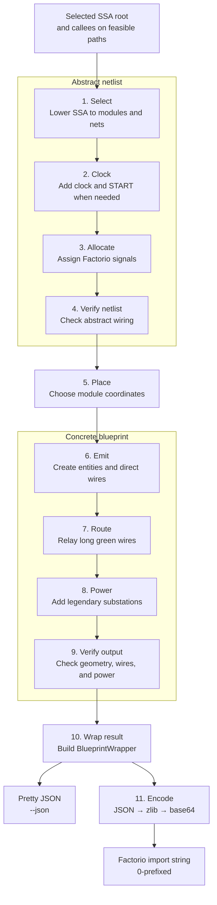

# Factorio Backend

`internal/factorio` compiles the supported Go subset from x/tools SSA into a
Factorio blueprint. This guide explains its phases, components, and design
choices. The canonical rules live in the [specification](spec.md). The
[blueprint format](blueprint.md) is the wire-format reference.

Bare Go filenames refer to `internal/factorio/`.

## Glossary

These definitions describe how the terms are used in this guide.

| Term                                                | Meaning                                                                                                                                                           |
|-----------------------------------------------------|-------------------------------------------------------------------------------------------------------------------------------------------------------------------|
| Abstract data                                       | Data that describes the circuit's logic without naming exact Factorio entities, positions, or wires.                                                              |
| [Allocate](#signal-allocation)                      | The phase assigns one Factorio signal to each net connecting modules. This is signal allocation, not CPU register allocation.                                     |
| [Back edge](spec.md#loops)                          | A control-flow edge that returns to an earlier loop point.                                                                                                        |
| Backend                                             | The part of a compiler that turns an internal program model into final output for a platform or format, called the target. Here the target is a Factorio circuit. |
| [Blueprint](blueprint.md)                           | A description of Factorio entities, their settings, and their wires.                                                                                              |
| [Callee](spec.md#calls)                             | A function invoked by another function.                                                                                                                           |
| [Caller](spec.md#calls)                             | A function that invokes another function.                                                                                                                         |
| [Clock](spec.md#clock-and-reset)                    | The phase that adds timing when modules need to remember values.                                                                                                  |
| [Combinator](blueprint.md)                          | A Factorio entity that provides values, calculates values, or conditionally produces outputs.                                                                     |
| Concrete data                                       | Data that names the exact Factorio entities, positions, and wires.                                                                                                |
| Connector                                           | An attachment point on a Factorio entity where a wire connects.                                                                                                   |
| [Control flow](./ssa.md)                            | The order in which operations run, including branches, loops, calls, and returns.                                                                                 |
| [Control-flow graph (CFG)][cfg]                     | Basic blocks as nodes and possible transfers between them as directed edges.                                                                                      |
| Dominator                                           | A point that every path from the function entry to another point must pass through.                                                                               |
| [Entity](blueprint.md)                              | One placed Factorio object.                                                                                                                                       |
| [Exchange string](blueprint.md)                     | The compressed text that Factorio imports and exports as a blueprint.                                                                                             |
| Fan-out                                             | Sending one output to several consumers.                                                                                                                          |
| [Feasible control flow][cfg]                        | Blocks and edges that can execute after Boolean constant branches select their only possible arm.                                                                 |
| Fixed point                                         | A circuit state that does not change after another simulator tick.                                                                                                |
| Frame                                               | Storage for one active call in the recursive machine.                                                                                                             |
| Immediate dominator                                 | The closest other point that every path from the function entry to a point must pass through.                                                                     |
| Instruction                                         | One planned operation in the recursive machine.                                                                                                                   |
| Instruction selection                               | The compiler step that chooses target operations to implement operations in an intermediate representation.                                                       |
| [IR](./ssa.md)                                      | Intermediate representation, a compiler's internal model of a program. This backend consumes SSA IR and builds a Factorio-specific netlist IR.                    |
| Latency                                             | The delay between an input and its resulting output.                                                                                                              |
| Liveness                                            | Tracking which values will be used again.                                                                                                                         |
| Lowering                                            | Translating a program operation into a more concrete Factorio form without changing what it does.                                                                 |
| Module                                              | One abstract backend component for an operation or control feature. A module can emit one or more Factorio entities.                                              |
| Net                                                 | A logical connection from one producer to its consumers.                                                                                                          |
| Netlist                                             | A graph of circuit components and the logical connections between them.                                                                                           |
| [Phi](./ssa.md)                                     | An SSA operation that chooses the value arriving from the control-flow path that ran. Loop phis also carry values between iterations.                             |
| Port                                                | A module's logical connection point.                                                                                                                              |
| Private connection                                  | A connection that stays inside one module and may use a red or green wire.                                                                                        |
| Program counter                                     | The value that selects the next recursive-machine instruction.                                                                                                    |
| Public connection                                   | A connection that crosses a module boundary and uses a green wire.                                                                                                |
| [Pulse](spec.md#clock-and-reset)                    | A signal that lasts for one tick.                                                                                                                                 |
| [Recurrence](spec.md#loops)                         | A calculation of the next value from values kept from the previous iteration.                                                                                     |
| Register                                            | A circuit module that remembers a value between clock pulses. It is not a CPU register.                                                                           |
| Register allocation                                 | Assigning live values to a CPU's limited registers.                                                                                                               |
| [Root](spec.md#calls)                               | The function selected as the blueprint entry point.                                                                                                               |
| Select                                              | The first backend phase, which builds an abstract Factorio netlist from supported SSA.                                                                            |
| [Signal](spec.md#values-inputs-and-display)         | A named integer carried by a Factorio circuit network. A zero value is indistinguishable from no signal.                                                          |
| [Signed `int32`](spec.md#values-inputs-and-display) | A 32-bit integer from -2,147,483,648 to 2,147,483,647.                                                                                                            |
| Slot                                                | A storage location for one value in an active recursive-machine call.                                                                                             |
| Spilling                                            | Storing values in memory when they do not fit in CPU registers.                                                                                                   |
| [SSA](./ssa.md)                                     | Static single assignment, a program form in which each value is defined once.                                                                                     |
| [START](spec.md#clock-and-reset)                    | The signal that enables circuit timing.                                                                                                                           |
| Tick                                                | One circuit update. Arithmetic and decider combinators read the old values and publish their results for the next tick. Constant signals are present immediately. |
| Union-find                                          | An algorithm that groups connected objects. The simulator uses it to find connectors joined into one wire network.                                                |
| Wire                                                | A connection between two Factorio entity connectors.                                                                                                              |
| [Wrapping](spec.md#values-inputs-and-display)       | Arithmetic that continues at the other end of the signed `int32` range after passing one end.                                                                     |

[cfg]: ./ssa.md#control-flow-graphs

## Why this package exists

x/tools SSA is a graph: values flow along edges from producers to consumers.
Factorio's circuit network is also a graph: signals travel along wires from
combinator outputs to combinator inputs. That structural similarity is the
whole idea. A supported SSA function projects onto Factorio entities with
little distortion, so this package is a real compiler backend: SSA in, a
placed-and-routed blueprint out. Tests use a synchronous tick simulator to
check representative circuits. This input is the analysis-oriented x/tools
representation, not the production Go compiler's private SSA.

## The shape of the design

A function becomes a **netlist of modules**. Select transforms supported SSA
values into this Factorio target IR; control-flow markers emit no entity, and
selection synthesises constructs such as loop registers and recursive
execution. Emit materialises the modules and edges as numbered entities and
wires. Route and Power then append physical infrastructure.

Two cross-cutting rules underpin everything below, so they come first:

- **Module boundaries use green.** Public connections between modules use green,
  and red wires never cross a module boundary. Private wiring inside a module
  may use either colour when independent internal nets must remain separate. The
  invariant is boundary ownership, not a one-to-one colour classification.
- **Zero is absent.** A Factorio wire cannot tell a signal of value zero from no
  signal at all. Every "why" about booleans, the 1/-1 encoding, parameter
  defaults, and clock startup traces back to this one fact.

## Module Dependencies

The module library has three dependency layers.

### Substrate

`ir.go` defines the abstract netlist, `emit.go` owns concrete emission state,
`entity.go` defines the Factorio JSON types and operator map, and `signal.go`
defines the two signal banks. `geometry.go` owns occupied-cell derivation and
shared distance and interpolation calculations used by Route, Power, and output
verification. The tick simulator lives in `sim_test.go`. Every module emits
entities through this substrate. The simulator verifies their circuit
behaviour.

### Leaf Modules

`constSrc` (a constant source), `arith` (`a op b`), and `neg` (`x * -1`) are
single combinators whose ports are that combinator's own connectors. Select
creates them for ordinary SSA values.

### Composite Modules

These emit several combinators with private wiring and expose green ports.

- **`compare` feeds `phi`.** `compare` emits the condition as **present 1
  for true, present -1 for false** on a green net. `phi` reads that condition
  to pick a branch. `compare` spends three combinators because the fields
  gofactos emits let a decider produce a fixed 1 or copy an input, but not
  produce a fixed -1. The merge needs a *present* false (see "Zero is absent"),
  so arithmetic creates -1.
- **`phi` is the merge, and the wire is the phi.** Both branch values are gated
  by the condition and driven onto one shared red sum net. Exactly one gate is
  ever live, so the sum settles to the winner: the wire literally does the
  selection. **Why the condition is read on green, not red:** recolouring it to
  red and fanning it to both gates would union the two branches' nets and sum
  *both* values, defeating the merge. Keeping the condition on green leaves the
  branch nets disjoint.
- **`clockDiv` owns time, start, and reset.** Its default-off constant emits the
  one public START signal. A START-gated one cell and a modulo cell share one
  private red net, so clock phase pauses while off and stays bounded within the
  selected period instead of overflowing signed int32. A decider emits the
  one-tick pulse while START remains on. Clockless programmes request no divider
  or START control. A loop bound is a green port because the player can edit a
  root parameter in game.
- **`register` and `stopGate` make a loop terminate.** A `register` is a clocked
  memory cell (the loop-carried phi made physical): hold, write, and an output
  bridge on a private red net, latching `next` on the pulse and holding via a
  self-feed between pulses. START gates that hold path, so OFF clears retained
  state. Initialised registers store an offset privately, so zero, positive,
  and negative phi initials cost no public net. The offset bias wraps as int32,
  including `MinInt32`, so every emitted constant remains valid. A `stopGate`
  passes the clock pulse only while START is on and `index < bound`. Its
  recurrence form adds a private one-period warm-up, suppressing the first raw
  pulse without changing the global clock. OFF resets both count and readiness,
  so every rerun receives the same settling interval.
  **Why a 0/1 flag, not the merge's 1/-1:**
  `pulse * go` must zero the pulse when stopped, and a `-1` would invert it
  rather than kill it.

`boolDisplay` is the boolean readout showing a check icon for true and a deny
icon for false. `digitDisplay` is the integer readout, a multi-digit chain that
drives the per-digit panels. `recursiveMachine` executes one compiled
direct-self-recursive program. `program.go` validates and plans recursive SSA,
`machine.go` orchestrates machine emission, `action.go` emits instruction
actions, and `layout.go` owns physical layout and wiring. Route appends
medium-pole relay hops after Emit when a green wire exceeds circuit reach.
Private red wires must fit within direct circuit reach.

## Backend Phases

The [architecture guide](architecture.md) shows the end-to-end command flow.
This diagram follows one selected SSA root through the backend to both command
outputs:

Steps 1–9 are `compileFunction`. `Compile` performs step 10. The CLI then
prints the wrapper as pretty JSON for `--json`, or calls `Encode` to produce the
default exchange string. Inside `compileFunction`, the phases run in this order:

| Phase    | Does                            | Why it sits here                |
|----------|---------------------------------|---------------------------------|
| Select   | Preflight calls; build netlist  | Feeds every later phase         |
| Clock    | Insert `clockDiv` when needed   | After state selection           |
| Allocate | Assign one signal per net       | Counts pulse and START nets     |
| Verify   | Run `verifyNetlist`             | Fails before physical work      |
| Place    | Record positions and footprints | Required by Emit                |
| Emit     | Materialise entities and wires  | First concrete output           |
| Route    | Relay long green wires          | Needs exact connector positions |
| Power    | Add powered substations         | After every emitted entity      |
| Verify   | Run `verifyOutput`              | Last, after Power               |

### Ordering

- **Why Clock follows Select.** A clock only makes sense once a stateful module
  exists. Select leaves its `pulse` and `start` ports unwired; Clock adds one
  `clockDiv` and fills them. Clock must still run before Allocate, Place, and
  Emit so that its module receives signals, coordinates, wiring, and entities
  like every other module.
- **Why Select and Emit are different boundaries.** Select lowers source-led
  x/tools SSA concepts into the Factorio netlist. Emit later calls each
  module's `build`, mints entity numbers, and materialises each green port edge
  as a numbered wire. The earlier netlist phases never touch entity numbers.
  Route and Power append relay poles and substations after Emit. They, and
  `verifyOutput`, need the exact connector positions that exist only once the
  netlist is concrete.
  Estimating spans from module anchors mislocates ports on tall composite
  modules, so the accurate place to relay and power is post-Emit.

`compileFunction` in `compile.go` runs this sequence. `Compile` wraps its
emitted result in the public `BlueprintWrapper`.

## Mapping to the real Go compiler

This mapping is conceptual, not code reuse. The Go references are under
`src/cmd/compile/internal` and `src/cmd/internal/obj` in the Go repository.

| Gofactos       | Closest Go source                      |
|----------------|----------------------------------------|
| Load           | `syntax`, `types2`, `noder`            |
| Build SSA      | `ssagen.buildssa`                      |
| Compile        | `ssagen.Compile`                       |
| Select         | `ssa.lower`, architecture rewrites     |
| Netlist IR     | lowered `ssa.Func`                     |
| Clock          | no counterpart                         |
| Allocate       | `ssa.regalloc`                         |
| Netlist Verify | debug-only `ssa.checkFunc`             |
| Place          | `ssa.layout`, `ssa.schedule`           |
| Emit           | `ssagen.genssa`, architecture packages |
| Route          | assembler branch repair                |
| Power          | no counterpart                         |
| Output Verify  | assembler diagnostics                  |
| Encode         | `gc.dumpobj`, `obj.WriteObjFile`       |

The authoritative overview is `src/cmd/compile/README.md`. The scheduled SSA
passes live in `internal/ssa/compile.go`; target emission starts in
`internal/ssagen/ssa.go`. Architecture packages provide the emitters. The 386
target uses `internal/x86`; wasm keeps `Init` and its emitters in
`internal/wasm/ssa.go`; most other targets keep emitters in
`internal/<arch>/ssa.go` and wire them in `galign.go`. Final object writing runs
through `gc.dumpobj` and `obj.WriteObjFile`. For the local input,
`golang.org/x/tools/go/ssa/doc.go` describes the source-oriented analysis IR.

Important differences keep the analogy honest:

1. Gofactos uses `golang.org/x/tools/go/ssa`, not
   `cmd/compile/internal/ssa`.
2. x/tools SSA serves analysis tools and is not a step in `go build`.
3. Select consumes SSA and creates a separate netlist. Go `lower` rewrites
   compiler SSA into target-specific compiler SSA.
4. Gofactos phases are not registered in Go's SSA `passes` table.
5. Allocate is a resource-allocation analogy, not CPU register allocation.
6. Place, Route, and Power exist because this output is spatial and physical.
7. Gofactos compiles one supported root and its supported callees, not
   arbitrary packages or the full Go language.
8. The order is target-driven, not copied from Go. Go lays out and schedules
   before register allocation; Gofactos allocates signals before placement.
9. Go has no general Route phase. Some assemblers repair out-of-range branches,
   but that does not route data nets through physical space.
10. Go's `ssa.checkFunc` analogue is a debug check enabled with
    `-d=ssa/check/on`; Gofactos always runs `verifyNetlist`.

## Control-Flow Lowering

Select maps each SSA value to its producer and each operand use to a public net.
Control flow needs extra lowering because source shapes do not always produce
the expected SSA instructions. `select.go` orchestrates ordinary SSA lowering,
`flow.go` derives feasible control flow, `scalarloop.go` recognises single-state
counted loops, `recurrence.go` analyses multi-state recurrences, and `result.go`
owns return and merge handling.

- **Constant branches define the feasible CFG.** x/tools keeps both raw edges
  for `if true` and `if false`. Select retains only the possible arm before it
  validates operations, calls, cycles, returns, or loop shape.
- **Two-return functions need a physical merge.** A function that returns from
  two feasible arms has two `Return` instructions and no result `Phi`. The
  controlling branch must dominate both returns in the feasible CFG. Each arm
  may cross later supported blocks and value merges, but it must reach one
  distinct return. Select synthesises a `phi` module from that condition and
  those return values.
- **Mid-function phis use feasible dominance.** Select finds the controlling
  branch through the phi block's immediate dominator in the feasible CFG and
  maps each incoming edge to its arm during ordinary lowering. If constant
  filtering leaves one input, the phi aliases that producer and adds no
  physical module. Recursive planning instead preserves phi inputs as moves on
  the feasible incoming edges.
- **Counted loops become clocked state.** Select checks the feasible entry,
  body, back-edge, and exit paths, reads the external bound, and creates
  registers plus a `stopGate`. Constant-controlled detours, one-input phis, and
  auxiliary loop-invariant phis whose feedback points back to themselves become
  aliases; executable branches and early exits still fail. The gate stops
  pulses when the SSA loop condition becomes false, so the registers hold the
  result.
- **Recurrences update in parallel.** Select creates every register producer
  and invariant alias before connecting next-state equations. Every equation
  therefore reads the old state, and all changing registers latch together
  after the warm-up period.
- **Ordinary calls expand at each invocation.** Discovery and preflight inspect
  feasible blocks only. Parameters alias caller producers, while callee-local
  values receive a fresh expansion path. The callee result becomes the call
  value without a copy module.
- **Direct self-recursion uses a runtime machine.** Select compiles operations,
  branches, phi moves, calls, resumes, and returns from feasible blocks into a
  PC-based plan. `recursiveMachine` executes that plan with addressed frames
  and value slots.

The [specification](spec.md) defines the accepted shapes and resource limits.

## Boolean Encoding

Because zero is absent. A boolean false encoded as 0 is indistinguishable from
no signal, which breaks any consumer that must read false as a real value and
breaks the merge because a silent false would let the other branch win. False
is therefore -1 and true is 1. `constInt` and `compare` emit the same encoding.

## Signal Allocation

The [specification](spec.md) defines the rules; this section
explains them.

Allocate resembles register allocation because both bind abstract values to
finite target resources. It is not Go register allocation: it has no liveness
analysis, signal reuse, spilling, CPU registers, or stack slots.

Allocate assigns one signal per public net from two finite banks. Retained root
inputs use virtual signals by signature position. Intermediate values use a
stable list of item signals, so generated labels remain predictable across
programmes. Callee parameters alias caller producers instead of consuming new
inputs.

There is no reuse or spill. Private module wiring and recursive-machine slots
use local signals outside the public banks. The [specification](spec.md) owns
the bank limits and failure rules.

## How the simulator works

Importing a blueprint only proves that its format is valid. It may still compute
the wrong result. The tick simulator (`sim_test.go`) runs the circuit quickly.
Tests compare simulated component and program results with Go, including each
loop's final result.

It models the circuit network directly:

- **Networks are union-find.** Each `(entity, connector)` pair is a node, and
  every wire unions two nodes into one network. State is a map from network id
  to signal name to value, so a wired-together group of connectors shares one
  value map, exactly as the engine merges wire-connected entities.
- **A tick is synchronous.** `step` computes the entire next state from the
  current state, and `advance` installs it. Arithmetic and decider combinators
  read the previous tick and write the next; constant signals are already
  present. Nothing newly computed this tick is visible until the next one. This
  read-all-then-write-all rule is what gives arithmetic and decider combinators
  one tick of latency, and it is why every feedback loop in the design has to
  settle its value before the clock pulse arrives.
- **Inputs merge, outputs fan out, zero is absent.** An arithmetic or decider
  combinator reads a signal as the sum of its red-in and green-in networks, and
  writes its result to both its red-out and green-out networks. A computed zero
  is never written, matching the engine's zero-is-absent rule. Network sums and
  arithmetic use signed int32.
- **Three combinator kinds.** A constant combinator emits its filters onto its
  own input connectors. An arithmetic combinator computes `a op b`. A decider
  evaluates all its conditions with their explicit joins and, when true, emits
  each output as a fixed `1` or the copied input count. Omitted joins default to
  OR, matching Factorio 2.0.

There are two ways to drive it. `simulate` is for circuits expected to reach a
whole-state fixed point: it ticks until the state stops changing and fails if
the tick cap expires. `advance` steps once to inspect clock, startup, and
state-machine timing. Clocked loop and recursive tests use bounded stepping and
inspect their defined result or status points; while START remains on, their
running clock means the complete circuit does not converge even after work
stops. Real-engine E2E tests check assumptions the simulator cannot prove.

The simulator lives in a `_test.go` file because production does not use it.
The [testing guide](testing.md) explains how each validation layer runs.
